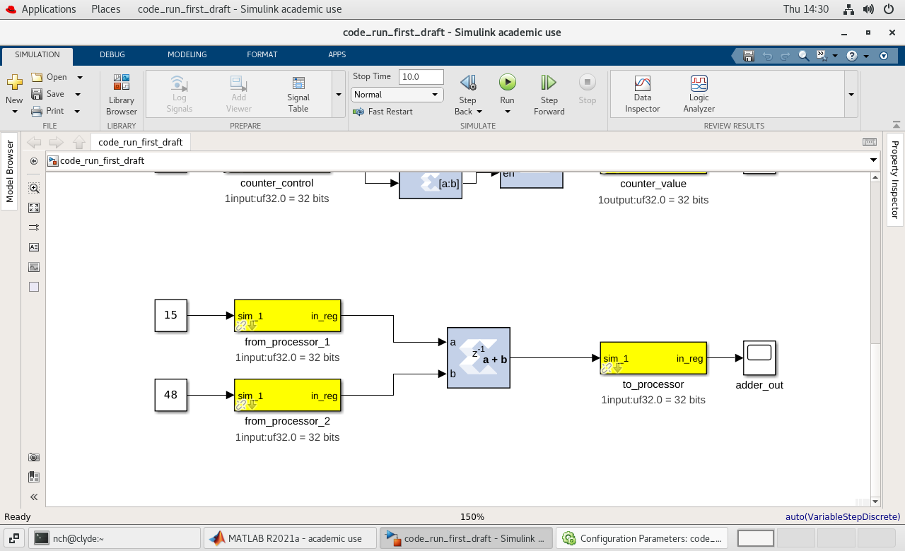
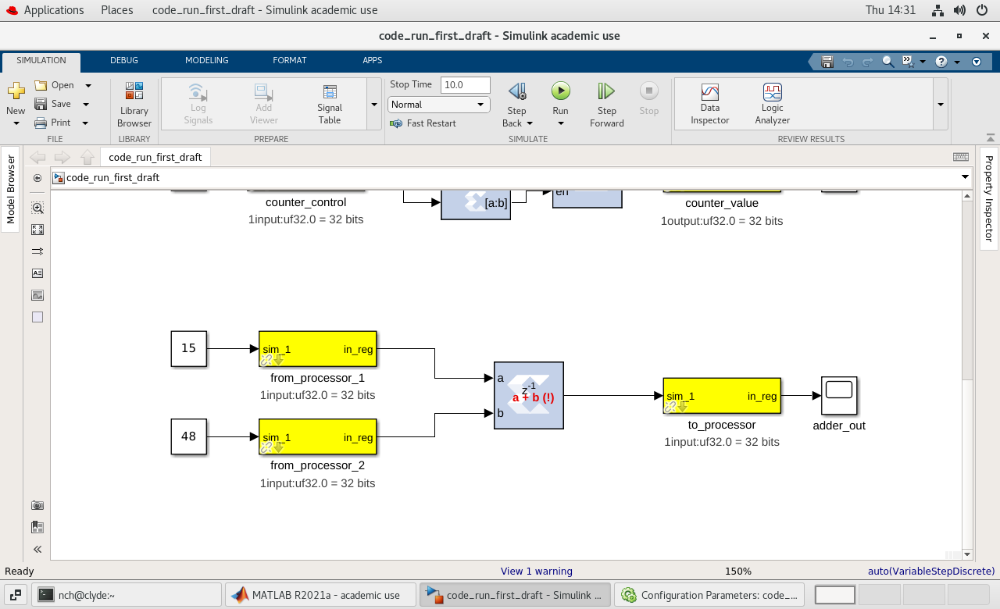
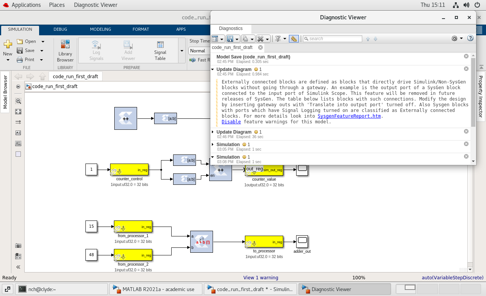

# 11/29/2025 

I realized that my issue yesterday was a non-issue.
Tutorial 1 shows that you do not need to fill anything in the "System Generator" block.
Simply including it, along with the yellow block for the platform, is enough. 

I am wondering if my personal PC is faster than Clyde, in terms of complilation

According to CPU Monkey, my PCs CPU is about 20% faster than Clyde. It probably is not worth it to move things onto my machine. 

Even still, it is tempting. Even if there is a *minute* increase in compilation speed, that would be great.

After I recompiled my design, I was able to identify I can *write* to these registers, but I cannot *read* from them.

I wonder if the answer is just to redo everything in this tutorial.

## Redoing Tutorial 1.

Added "System Generator" and "platorm" blocks.

The following text made no sense to me, as a newbie.

```
For the RFSoC platform the `adc_clk` user IP clock source is derived from the `pl_clk` coming from the first stage PLL in the clocking hierarchy for the RFDC. In most cases this is an LMK creating the `pl_clk` in addition to the clock that drives the RFDC tiles. This frequency coming from the LMK as `pl_clk` is what is to be entered into the `RFPLL PL Clock Rate field`. In other words, this is the clock rate the design is expecting to produce as the clock frequency for the user IP clock.
```

Words that did not make sense:
* `adc_clk` --> Analog to digital converter clock? 
* `pl_clk` --> Programmable logic clock? [This link helped](https://docs.amd.com/r/en-US/pg201-zynq-ultrascale-plus-processing-system/PL-Clocks) --> helps tie everything together? --> Okay. It may be *the* way the FPGA is actually programmed? 
* PLL --> Phase-Locked Loop? --> Input and output are on the same phase
* Clocking hierarchy --> which clocks run first?
* RFDC --> RF Data Converter; [this guide](https://www.mathworks.com/help/soc/ug/transmit-and-receive-tone-using-RFSoC-device-simulate.html) helped.
* LMK --> A diagram on the TI product page for the [LMK01000](https://www.ti.com/product/LMK01000) lists the LMK as a "Clock Divider and Distributor". A [tutorial by MathWorks](https://www.mathworks.com/help/soc/ug/multi-tile-synchronization-using-rfsoc-device.html) states taht "the default SYSREF frequency" is "produced by the LMK". 
* SYSREF Frequency --> Analog Devices produced [a guide](https://www.analog.com/en/resources/technical-articles/jesd204b-subclasses-part1-an-introduction-to-jesd204b-subclasses-and-deterministic-latency.html) that says "SYSREF . . . provides a system-level reference for sample timing"
* RFDC Tiles --> (from previous definition of RFDC) blocks / tiles you can use in CASPER representing RFDC.
* `RFPLL PL Clock Rate Field` --> Sets the clock rate for the programmable logic and the local oscillators.
--> * RFPLL --> Something used "to generate the required LO signals" according to [this guide](https://www.analog.com/media/cn/technical-documentation/user-guides/ad9364_reference_manual_ug-673.pdf) 
--> --> * LO Signals --> Local oscillator signals
--> * PL --> Programmable logic
--> * Clock Rate --> Rate programmable logic operates on?
--> * Field --> Region in the menu where this is input 
* Slice --> groups of LUTs (look up tables), flip flops, and multiplexers [(National Instruments)](https://www.ni.com/docs/en-US/bundle/labview-fpga-module/page/introduction-to-fpga-hardware-concepts-fpga-module.html)
--> * LUT --> Predefined list of outputs
--> * Flip-flop --> "a circuit capable of two stable states and represents a single bit" [(National Instruments)](https://www.ni.com/docs/en-US/bundle/labview-fpga-module/page/introduction-to-fpga-hardware-concepts-fpga-module.html)
--> * Multiplexer / Mux --> "a circuit that selects between two or more inputs and outputs" [(National Instruments)](https://www.ni.com/docs/en-US/bundle/labview-fpga-module/page/introduction-to-fpga-hardware-concepts-fpga-module.html)
* Fabric --> the way that the circuits / computational hardware of the FPGA is actually connected together.

Okay. I have just done parts 1 and 2.
I will compile this and see if this has fixed the issues I mentioned before.

# 11/28/2025

## Testing the links within all RFSoC tutorial pages:
See `fresh_eyes_notes/test_all_links/rfsoc_tutorials_link_testing_reports.zip` for the full `.txt` files of the reports.

### Tutorial 1 broken links:
`https://casper-toolflow.readthedocs.io/projects/tutorials/en/latest/tutorials/rfsoc/tut_getting_started.md#core-setup`
--> WORKING: https://casper-toolflow.readthedocs.io/projects/tutorials/en/latest/tutorials/rfsoc/tut_getting_started.html#core-setup
`https://casper-toolflow.readthedocs.io/projects/tutorials/en/latest/tutorials/rfsoc/platforms/rfsoc2x2.md#rf-clocking`
--> WORKING: https://casper-toolflow.readthedocs.io/projects/tutorials/en/latest/tutorials/rfsoc/platforms/rfsoc2x2.html#rf-clocking
`https://casper-toolflow.readthedocs.io/projects/tutorials/en/latest/tutorials/rfsoc/readme.md#platforms`
--> WORKING: https://casper-toolflow.readthedocs.io/projects/tutorials/en/latest/tutorials/rfsoc/readme.html#platforms
`https://casper-toolflow.readthedocs.io/projects/tutorials/en/latest/tutorials/rfsoc/tut_getting_started.md#setup-casperfpga`
--> WORKING: https://casper-toolflow.readthedocs.io/projects/tutorials/en/latest/tutorials/rfsoc/tut_getting_started.html#setup-casperfpga
`https://casper-toolflow.readthedocs.io/projects/tutorials/en/latest/tutorials/rfsoc/tut_getting_started.md#setup-casperfpga`
--> WORKING: https://casper-toolflow.readthedocs.io/projects/tutorials/en/latest/tutorials/rfsoc/tut_getting_started.html#setup-casperfpga

#### Error Summary and Recommendations
Summary: these links are only broken because they link to `.md` files instead of `.html` files, like what browsers expect.
Recommendations: change these links so that (at least for browsers) they lead to `.html` files instead of `.md` files.
Reasoning: I realize that this *may* be by design, as these tutorials *can* be viewed through the GitHub GUI. 
However, if we are trying to "idiot-proof" the documentation, we *have* to account for the fact that the majority of the viewers of these tutorials will see them through their *browser*. 

### Tutorial 2 broken links:
NONE

### Tutorial 3 broken links:
`https://www.xilinx.com/support/documentation/ip_documentation/usp_rf_data_converter/v2_4/pg269-rf-data-converter.pdf`
--> redirected to useless link
--> ARCHIVE: https://web.archive.org/web/20210308030442/https://www.xilinx.com/support/documentation/ip_documentation/usp_rf_data_converter/v2_4/pg269-rf-data-converter.pdf
`https://www.xilinx.com/support/documentation/ip_documentation/usp_rf_data_converter/v2_4/pg269-rf-data-converter.pdf`
--> redirected to useless link
--> ARCHIVE: https://web.archive.org/web/20210308030442/https://www.xilinx.com/support/documentation/ip_documentation/usp_rf_data_converter/v2_4/pg269-rf-data-converter.pdf

### Tutorial 4 broken links:
`https://www.xilinx.com/support/documentation/ip_documentation/usp_rf_data_converter/v2_4/pg269-rf-data-converter.pdf`
--> redirects to useless link
--> ARCHIVE: https://web.archive.org/web/20210308030442/https://www.xilinx.com/support/documentation/ip_documentation/usp_rf_data_converter/v2_4/pg269-rf-data-converter.pdf

I went to [The WayBack Machine](https://web.archive.org/) to *possibly* find a working version of the `.pdf` link seen a few times above.
The only viable scrapping image that was taken of this site was 08 Mar 2021.
Every subsequent scrapping was unviable or redirected to a useless place, like what we see on the live site.
In short, this link has been dead for upwards of *four years*. 
https://web.archive.org/web/20210308030442/https://www.xilinx.com/support/documentation/ip_documentation/usp_rf_data_converter/v2_4/pg269-rf-data-converter.pdf

Under each link that goes to documentation other than our own, I will list a WayBack Machine archive.

## Getting back to finishing Tutorial 1

Okay. Now that the links are working, I can go in and actually follow each link to make sure I have my environment set up correctly.
That way, I can rule out some possible reasons why these errors during compilation.

### Reading [Core Setup](https://casper-toolflow.readthedocs.io/projects/tutorials/en/latest/tutorials/rfsoc/tut_getting_started.html#core-setup) 

Not having a conda environment active might have been the reason for this not working.

I switched to my conda environment and ran `jasper` in my "first_draft" design.
It is running further than any other time I ran `jasper`

It is stuck on `Waiting for synth_l to finish...` now.

I know the tutorial said that the compilation would take 20 minutes, but I am afraid that the script will fail any second. 

It is not stuck on `Waiting for synth_l to finish...` anymore. It is running Vivado.

Earlier, I saw a warning about how I had set up the system block.

There is a "Critical warning" of some kind.

I will keep an eye on this as I continue reading the documentation.
I am still terrified it will not compile, though.

in [Platform Processor System Setup](https://casper-toolflow.readthedocs.io/projects/tutorials/en/latest/tutorials/rfsoc/tut_getting_started.html#platform-processor-system-setup) I read "connect to the 1 GbE port and review the [Platform Network Configuration](https://casper-toolflow.readthedocs.io/projects/tutorials/en/latest/tutorials/rfsoc/tut_getting_started.html#platform-network-configuration) to understand how communication is established"

#### Point of Confusion:
Is this how I will connect tothe actual FPGA?
I have been wondering for a while now *how* to actually connect to the FPGAs that The Lab owns.

THE COMPILING IS COMPLETE. That did not take long at all.

Returned to reading [Programming the FPGA](https://casper-toolflow.readthedocs.io/projects/tutorials/en/latest/tutorials/rfsoc/tut_platform.html#programming-the-fpga) in the first tutorial. 

There, I read "shell into the board [the FPGA] using an ssh client..." 

Because I do not know what the IP address of the board is, I will go back to the [Platform Processor System Setup](https://casper-toolflow.readthedocs.io/projects/tutorials/en/latest/tutorials/rfsoc/tut_getting_started.html#platform-processor-system-setup) and continue reading that.

(read the section)

Okay. That was not helpful. I need to know what the IPs of the FPGAs are.

I could look something up, but something tells me that there are guides for this kind of thing on the GitLab for the *group*, in particular.

I did some rooting around. No joy.
It must be in there somewhere, but I could not find it. 

I reached out to R. Poll, who knows more about this than I do. He says the RFSoC 4x2 board is located at `192.168.2.140`

I will do a search of the GitLab (the entire thing) for any mention of this IP address.

Used `"192.168.2.140" inurl:gitlab.ras.byu.edu`. No joy.

Lets try sshing into the board directly. 

used `ssh casper@192.168.2.140` w/ "casper" being the password 

I got in! 

Interesting . . . `Last login: Sat May  1 14:40:45 2021 from 192.168.2.202` 

R. Poll said that he uses this board often, though. Why does it not show his logon?

Read to about [Step 1: Copy the `.fpg`....](https://casper-toolflow.readthedocs.io/projects/tutorials/en/latest/tutorials/rfsoc/tut_platform.html#step-1-copy-the-fpg-file-to-where-you-need-it) section. 
--> Realized I should not be sshd into the FPGA through ssh.
--> I need to follow the tutorial and (while in a conda env *in* Clyde), start an ipython session and do what is listed in Step 2.

Finding the file I had created was simple enough.
I ran `find . -name "*.fpg"` while at the top directory of my cloned git repo to show me where I had saved my code.

Make sure, when loading a file into `fpga.upload_to_ram_and_program(<path>)` that the `<path>` is to your `.fpg` file *from the perspective of the working directory in ipython*. 

```
In [10]: fpga.upload_to_ram_and_program('./tutorial_files/tutorial_1/first_run_draft/code_run_first_draft/outputs/code
    ...: _run_first_draft_2025-11-28_1649.fpg')
Out[10]: True
```
This is good! It appears my code has been uploaded!

### None of my uploaded code actually did anything.

All the software registers I check have only values of zero

All my registers. Not just the registers associated with the adder; the counters, as well.

I think it is safe to say that I chose the wrong board to have `System Generator` generate.

So what *is* the RFSoC 4x2?

(Looking at the documentation linked in the left banner of the screen)
(Links to AMD and RealDigital) 

Both sites say that it is a "Xilinx Gen 3 Zynq UltraScale+ RFSoC ZU48DR".

That, from what I remember, is not found in the "System Generator" block I had imported.

Maybe we do not *need* it?

(tries it, runs `jasper`, MatLab throws errors)

Okay. So. We need the "System Generator" block. 

So, what do we *put* as the board?

I tried figuring out what the board actually was by interrogating it through the command line.

The only commands that worked were as follows:

```
lscpu

Architecture:                    aarch64
CPU op-mode(s):                  32-bit, 64-bit
Byte Order:                      Little Endian
CPU(s):                          4
On-line CPU(s) list:             0-3
Thread(s) per core:              1
Core(s) per socket:              4
Socket(s):                       1
Vendor ID:                       ARM
Model:                           4
Model name:                      Cortex-A53
Stepping:                        r0p4
CPU max MHz:                     1199.9990
CPU min MHz:                     299.9990
BogoMIPS:                        66.66
Vulnerability Itlb multihit:     Not affected
Vulnerability L1tf:              Not affected
Vulnerability Mds:               Not affected
Vulnerability Meltdown:          Not affected
Vulnerability Spec store bypass: Not affected
Vulnerability Spectre v1:        Mitigation; __user pointer sanitization
Vulnerability Spectre v2:        Not affected
Vulnerability Tsx async abort:   Not affected
Flags:                           fp asimd aes pmull sha1 sha2 crc32 cpuid
```
and 
```
uname -a
Linux rfsoc4x2 5.4.0-xilinx-v2020.2 #1 SMP Mon Aug 15 19:08:58 UTC 2022 aarch64 aarch64 aarch64 GNU/Linux
```


# 11/27/2025

## Continuing first tutorial
NOTE TO FUTURE STUDENTS: YOU CAN USE THE MIDDLE MOUSE BUTTON TO PAN. 
--> This was something that was not described in the documentation that I would have found extremely helpful.

### (non) ISSUE: In [Tutorial 1 > Simulating the design](https://casper-toolflow.readthedocs.io/projects/tutorials/en/latest/tutorials/rfsoc/tut_platform.html#simulating-the-design)
--> "Under the simulate section of the simulation tab on the ribbon.."
--> Where?
--> In the middle of the screen, theres a search bar under the prepare tab
--> --> Is this what the documentation is talkinb about?
--> --> YES!

SOLUTION: 
1. Click the downwards arrow in the "PREPARE" drop down next to the "Library Browser" icon
2. Next, type "SIM" in the search bar.
3. Under "CONFIGURATION & SIMULATION" click "Model Settings"

REAL SOLUTION:
[FACEPALM] The tutorial brings up how the actual place to do this is RIGHT THERE.
It is in the same menu location that the "Run" button is.

### ISSUE: Red text appears on adder when running first draft of code

Before running the code, the "all at once" adder (part 3) looks like the following:


After running the code, the adder block contains `a + b (!)`, as shown below:


When I double click the block, then away from the block or click "Apply", the red text disappears.

I do not know why this happens

### ISSUE: Backend build failed!
In [Tutorial 1 > Compiling](https://casper-toolflow.readthedocs.io/projects/tutorials/en/latest/tutorials/rfsoc/tut_platform.html#compiling)
--> "To compile the design, go to the MATLAB command line and enter `jasper`"

I ran that. Did not compile. 

The error message reads as follows:
```
File "casper_tutorials_devel_fresh_eyes/casper/xilinx/mlib_devel/jasper_library/toolflow.py", line 960, in xml2vhdl
    from xml2vhdl.xml2vhdl import Xml2VhdlGenerate, helper
ImportError: No module named xml2vhdl.xml2vhdl
Error using jasper (line 23)
Backend build failed! Check log files for more information
```

I do not know what log file the error is talking about. It appears that the error comes from `toolflow.py` line 960.

This line *is* "in xml2vhdl from xml2vhd.xml2vhdl import Xml2VhdlGenerate, helper"

I am not sure how to get this error fixed.

Putting `"xml2vhdl.xml2vhdl"` into Google, we arrive at [a GitHub repo owned by Oxford Department of Physics under the "casper-astro" umbrella](https://github.com/casper-astro/xml2vhdl)

I believe this means that the Jasper (compiler?) toolflow does not have access to "xml2vhdl.xml2vhdl".
How does one fix this?

Something tells me that this is because I either used the wrong "System Generator" block and / or the wrong board in the "System Generator" block. 

#### Option 1: Wrong board in existing "System Generator" block
1. Changed board to "Xilinx Zynq UltraScale+ RFSoC ZCU1275 Characterization Kit 2.0"

2. Pressed "Run"

Bingo! At the bottom of the screen, "View 1 warning" appeared.

This same warning was present in the earlier screenshots (see above) 

3. Clicked "View 1 warning"

Clicking this error made the following window pop up:


The same warning is present across every simulation that I have run today:

>Externally connected blocks are defined as blocks that directly drive Simulink/Non-SysGen blocks without going through a gateway. An example is the output port of a SysGen block connected to the input port of Simulink Scope. This feature will be removed in future releases of SysGen. The table below lists blocks with such connections. Modify the design by inserting gateway outs with 'Translate into output port' turned off. Also Sysgen blocks with ports which have Signal Logging turned on are classified as Externally connected blocks. For more details look into SysgenFeatureReport.htm.
>Disable feature warnings for this model.

I do not know what this means.

I am not going to worry about it, for the moment.

### Point of confusion:
"In this design there are no IP that take advantage of this" 
--> What does "no IP" mean?

### ERROR:
"Program the LMK using the corresponding platforms utility (before proceeding make sure to have reviewed your platform’s [page](https://casper-toolflow.readthedocs.io/projects/tutorials/en/latest/tutorials/rfsoc/readme.md#platforms) for required clocking configuration and setup):"
--> The link does not work. 
--> As someone VERY unfamilliar with anything this guide is talking about, trying to follow along, the fact that MANY of these links do not work is DEEPLY frustrating.

I am going to try to find out how many dead links are in each page.

I did not ask chat GPT to make these commands.
I used it as a glorified Google search, trying to figure out what I CAN do and what would be most stable.

Draft one: works, `curl -I` (command to see if errors like 404 are thrown), requires a text dump of the HTML.

```
cat fresh_eyes_notes/tutorial_1_html_dump.txt | grep "reference external" | grep -oP '(?<=href=")[^"]*(?=")' | sed 's#\./#https://casper-toolflow.readthedocs.io/projects/tutorials/en/latest/tutorials/rfsoc/#g' | sed 's/^#/https:\/\/casper-toolflow.readthedocs.io\//g' | sed 's/^/curl -I /' > fresh_eyes_notes/tutorial_1_all_links.txt && bash fresh_eyes_notes/tutorial_1_all_links.txt > fresh_eyes_notes/tutorial_1_test_all_links.txt
```

Draft two: works, `curl -I` tests unclear, uses `curl` instead of an HTML dump.

```
curl https://casper-toolflow.readthedocs.io/projects/tutorials/en/latest/tutorials/rfsoc/tut_platform.html | grep "reference external" | grep -oP '(?<=href=")[^"]*(?=")' | sed 's#\./#https://casper-toolflow.readthedocs.io/projects/tutorials/en/latest/tutorials/rfsoc/#g' | sed 's/^#/https:\/\/casper-toolflow.readthedocs.io\//g' | sed 's/^/curl -I /' > fresh_eyes_notes/tutorial_1_all_links.txt && bash fresh_eyes_notes/tutorial_1_all_links.txt > fresh_eyes_notes/tutorial_1_test_all_links.txt
```

Draft three: works, does not immediately run `curl -I` tests.

```
curl https://casper-toolflow.readthedocs.io/projects/tutorials/en/latest/tutorials/rfsoc/tut_platform.html | grep "reference external" | grep -oP '(?<=href=")[^"]*(?=")' | sed 's#\./#https://casper-toolflow.readthedocs.io/projects/tutorials/en/latest/tutorials/rfsoc/#g' | sed 's/^#/https:\/\/casper-toolflow.readthedocs.io\//g' | sed 's/^/curl -I /' > fresh_eyes_notes/tutorial_1_all_links.txt
```

Draft four: to be run within a `.sh` file with executable permissions:
```
#!/bin/bash

while IFS= read -r cmd; do
    echo "$cmd" >> $1               # write the command itself
    eval "$cmd" 2>&1 | sed 's/^/    /' >> $1   # run command and indent result
done < <(rm -f $1 | curl $2 | grep "reference external" | grep -oP '(?<=href=")[^"]*(?=")' | sed "s#^\./#$3#g" | sed 's/^/curl -I /')

```

Usage:
```
./[COMMAND_FILE_ITSELF] ./[DESTINATION_TXT_FILE] [HTTPS_URL_TO_TUTORIAL_PAGE] [HTTPS_URL_TO_PREPEND]
```
Explanation:
The CASPER documentation is, apparently, very similar to a Linux-based file system.
Every EXTERNAL-FACING link we want to investigate on `[HTTPS_URL_TO_TUTORIAL_PAGE]` (the tutorial page we are investigating) has the same URL prepended to it: [HTTPS_URL_TO_PREPEND] 
This prepended URL is shown to the user when the user hovers above the link in the browser.

The path to the [COMMAND_FILE_ITSELF] is from the perspective of the working directory TO the script ex: `../../path/to/where/the/file/is/stored`
HOWEVER, the path to the [DESTINATION_TXT_FILE] is from the perspective of the working directory INDEPENDENT of the script ex: `./i_want_my_file_saved_in_my_working_directory`

Breakdown of what the code means:
```
x$
```
Run the xth (1-indexed) argument when the command file itself is run.
```
#!/bin/bash

while IFS= read -r cmd; do
    echo "$cmd" >> $1               # write the command itself
    eval "$cmd" 2>&1 | sed 's/^/    /' >> $1   # run command and indent result
done < <(rm -f $1 | curl $2 | grep "reference external" | grep -oP '(?<=href=")[^"]*(?=")' | sed "s#^\./#$3#g" | sed "/^#/d" |  sed 's/^/curl -I /')
```
The `COMMAND` presents this loop with, essentially, a file where every line is a new bash command.
This while loop prints each command, runs it, then prints the results of that command to an output file the user specifies.

The command itself:
```
rm -f $1 | curl $2 | grep "reference external" | grep -oP '(?<=href=")[^"]*(?=")' | sed "s#^\./#$3#g" | sed "/^#/d" |  sed 's/^/curl -I /'
```
Command 1: try to remove the output file the user specifies (do not check to see if it exists, first)
Command 2: grab the HTML of the tutorial page we want to investigate
Command 3: filter the HTML that exist within `<href></href>` brackets
Command 4: prepend the URL to each entry that points AWAY from the page we are investigating
Command 5: delete any URL pointing to another section within the page we are investigating
Command 6: prepend the command `curl -I` to each entry

# 11/26/2025

## Restarting MatLab w/ SimuLink and CASPER

On resuming; restarting MatLab w/ SimuLink and CASPER was the hardest part.

To restart MatLab in this way, perform the following command
`cd <tutorial_repo_path>/casper/xilinx/mlib_devel/ && ./startsg startsg.local`

## Errors and other comments

In [the first tutorial](https://casper-toolflow.readthedocs.io/projects/tutorials/en/latest/tutorials/rfsoc/tut_platform.html), read:
"See the clocking section of the RFSoC2x2 platform page"

The embedded link mentioned here leads to a page that doesnt exist.

Just below heading labeled ["Simulating the Design"](https://casper-toolflow.readthedocs.io/projects/tutorials/en/latest/tutorials/rfsoc/tut_platform.html#simulating-the-design)
--> Sees diagram with "System Generator" block.

I dont know what this block means.
I did a search for the block in "Library Browser > Search"
I imported the block under "Xilinx Toolbox - 3"

The block appears to ask for what board the code will be compiled on.

From what I understand, Im working with an ["RFSoC 4x2"](https://casper-toolflow.readthedocs.io/projects/tutorials/en/latest/tutorials/rfsoc/platforms/rfsoc4x2.html#rfsoc-4x2).

The dropdown menu for the block doesnt contain a *direct* link to RFSoC 4x2.
I will look in the documentation to see if theres a more verbose name for the 4x2 board we have.

According to [this guide](https://www.rfsoc-pynq.io/), it appears that an RFSoC 4x2 is actually called:
"Zynq UltraScale+ RFSoC ZU48DR"

There is no direct match to this, either.

I decided to go with the following, since it contains a "4" in the name.
"Zynq UltraScale+ ZCU104 Evaluation Board RevC"

# 11/17/2025

I was informed by M. Burnett that I was working on the wrong tutorials.
I need to focus on the RFSoC tutorials.

In the first tutorial, I ran a few commands:
```
mkdir casper
cd casper
git clone https://github.com/casper-astro/mlib_devel.git
cd mlib_devel
git checkout -b m2021a origin/m2021a

# install package dependencies
pip install -r requirements.txt

# initialize submodules
git submodule init
git submodule update
```

This resulted in the following string of errors:
```
You are running Setuptools on Python 2, which is no longer
supported and
>>> SETUPTOOLS WILL STOP WORKING <<<
...
https://github.com/pypa/setuptools/issues/1458
    about the steps that led to this unsupported combination.
    ************************************************************
      sys.version_info < (3,) and warnings.warn(pre + "*" * 60 + msg + "*" * 60)
    running develop
    error: cant create or remove files in install directory
    
    The following error occurred while trying to add or remove files in the
    installation directory:
    
        [Errno 13] Permission denied: '/usr/lib/python2.7/site-packages/test-easy-install-92084.write-test'
    
    The installation directory you specified (via --install-dir, --prefix, or
    the distutils default setting) was:
    
        /usr/lib/python2.7/site-packages/
    
    Perhaps your account does not have write access to this directory?  If the
    installation directory is a system-owned directory, you may need to sign in
    as the administrator or "root" account.  If you do not have administrative
    access to this machine, you may wish to choose a different installation
    directory, preferably one that is listed in your PYTHONPATH environment
    variable.
    
    For information on other options, you may wish to consult the
    documentation at:
    
      https://setuptools.readthedocs.io/en/latest/easy_install.html
    
    Please make the appropriate changes for your system and try again.
```

PLEASE NOTE: this link lead to a page that didnt exist.

```
Command "/usr/bin/python2 -c "import setuptools, tokenize;__file__=/home/nch/Documents/CASPER/RFSOC/casper/mlib_devel/src/xml2vhdl-ox/scripts/python/xml2vhdl-ox/setup.py;exec(compile(getattr(tokenize, open, open)(__file__).read().replace(\r\n, \n), __file__, exec))" develop --no-deps" failed with error code 1 in /home/nch/Documents/CASPER/RFSOC/casper/mlib_devel/src/xml2vhdl-ox/scripts/python/xml2vhdl-ox
You are using pip version 8.1.2, however version 25.3 is available.
You should consider upgrading via the pip install --upgrade pip command.
```

PLEASE NOTE: these errors are similar, if not identical, to the errors I ran into when trying to perform the original CASPER tutorials.
This implies I need to use a virtual environment when working on Clyde. However, `venv` and `conda`, the two virtual environment packages I know about, arent included on Clyde.

Read [the CASPER RFSoC README](https://casper-toolflow.readthedocs.io/projects/tutorials/en/latest/tutorials/rfsoc/readme.html#) to get started.
To be completely candid and transparent, I have no idea what most of this meant. 
I can guess what "direct sampling" meant, but other terms such as "mixer," "numerically controlled oscillator (NCO)," "interpolation," and "decimation" were foreign to me.

---

I logged off my laptop and headed home. For some reason, when I SSHd into Clyde, `Conda` command was present on Clyde. 
So, I ran `conda create --name RFSOC_TRY_1 python=3.9` to create a virtual environment to try this.

I made a folder for a new install and cloned into the tutorial repo. 

From there, I changed my directory to the cloned repo. 

Then, I ran `conda activate RFSOC_TRY_1` to activate the environment.

There is a script that J. Naylor wrote that streamlined the install process.

I used `chmod +x casper_installer_7_9_25_jaxson.sh` to grant the installer executable permissions.

From there, I ran the installer by using `./[path_to_script]/casper_installer_7_9_25_jaxson.sh`

I was asked to confirm my installation directories for certain dependencies like python or Xilinx.
I didnt need to update any of the paths. 
From what Ive been told, this was because I was in a Conda environment.

Started following [Tutorial 1](https://casper-toolflow.readthedocs.io/projects/tutorials/en/latest/tutorials/rfsoc/tut_platform.html)

Following the tutorial in earnest meant creating a VNC connection into the server.

From there, I ran `./casper/xilinx/mlib_devel/startsg` to start MatLab with the needed dependencies.

From what I understand, this is what needs to be run every time MatLab is started.

From there, I started Simulink by clicking the icon on the titlebar.

Ive made it to Step 1 without incident. The documentation is becoming more and more clear.


 

# 11/12/2025
CASPER TUTORIALS DAY TWO:

Working on installing CASPER on a VNC server on Clyde. 

Picking up where I left off: 

- Reading [installing the Toolflow](https://casper-toolflow.readthedocs.io/en/latest/src/Installing-the-Toolflow.html)....

- --> "The toolflow is very sensitive to mis-matching software versions"

Because I dont have physical access to the lab where Clyde is running, at the moment, I need to see what type of software is already installed. Using *that* information, I can reference the table listed in the documentation and see what type of hardware were running. 
Hopefully.

Right. Okay. Lets find what operating system, MATLAB, Xilinx, Python, and subsequent mlib_devel branch / commit I should pull from.

Ran `cat /etc/os-release` when SSHd on Clyde.

Saw:
```
NAME="Red Hat Enterprise Linux Server"
VERSION="7.9 (Maipo)"
ID="rhel"
ID_LIKE="fedora"
VARIANT="Server"
VARIANT_ID="server"
VERSION_ID="7.9"
PRETTY_NAME="Red Hat Enterprise Linux"
ANSI_COLOR="0;31"
CPE_NAME="cpe:/o:redhat:enterprise_linux:7.9:GA:server"
HOME_URL="https://www.redhat.com/"
BUG_REPORT_URL="https://bugzilla.redhat.com/"

REDHAT_BUGZILLA_PRODUCT="Red Hat Enterprise Linux 7"
REDHAT_BUGZILLA_PRODUCT_VERSION=7.9
REDHAT_SUPPORT_PRODUCT="Red Hat Enterprise Linux"
REDHAT_SUPPORT_PRODUCT_VERSION="7.9"
```

Okay . . . the table on the CASPER page lists all the supported operating systems in terms of Ubuntu.
SO. What version of Ubuntu is equivalent to Red Hat Enterprise 7.9?

[Does some research]

It appears that Ubuntu isnt directly comparable to Red Hat. This is probably painfully obvious to those with more experience, but its news to me.

So, which type of Ubuntu is *relatively* equivalent? How would I even figure that out?

[Quick Google search]

Okay. I need to find what kernel version the linux install on Clyde currently is.

ran `uname -r`

Found:
`3.10.0-1160.53.1.el7.x86_64`

Okay. What version of Ubuntu matches that kernel?

Reads a timeline w/ version history [in this WikiPedia Article](https://en.wikipedia.org/wiki/Linux_kernel_version_history).
- The kernel version *exists*. 
- Its called "Baby Fish?" Interesting.

[Searches `"baby fish" AND ubuntu`]

Nothing.

Okay . . . let's try: `ubuntu with AND "3.10" AND "kernel"`

Wow. Thats interesting. Nothing is here. This feels like I'm doing something wrong.
As a user, Im scared of downloading the wrong type of toolflow, since "the toolflow is very sensitive to mis-matching software versions."
It would be great if there was a table comparing RHEL releases to Ubuntu.

Someone says it in plaintext [in this Reddit post](https://www.reddit.com/r/linux/comments/1hhl3z/ubuntu_1310_is_now_based_on_the_latest_stable/).

Well, that doesnt match with anything on the table.

[Reads the table more closely]

Oh. Were probably running something equivalent to Ubuntu 20.04, since thats the only *other* choice listed.

Okay. 

`Ubuntu Version ≈ 20.04`

What about MATLAB?

I know from experience trying to install MATLAB on Linux for ECEn 380 that matlab versions are stored in `~/.matlab/`.

I checked there. Were running R2021a

`MATLAB Version = R2021a`

Okay. How can I find what version of Xilinx were using?

Ran `find . -name "xilinx"` to show everything in the directories I have access to from `/home/[my_username]` that have "xilinx" in the title of the filename.

Found:
```
./.Xilinx/Vivado/2021.1/.....
``` 

`Xilinx Version = 2021.1`

Okay. This doesnt actually help us narrow down what hardware were using.

Just out of curiosity, I ran: `find . -name "casper"`

Found: 
`./sandbox/casper_sandbox/casper`

This means we already have an installation of CASPER!
This would have been *really* good to know before I went down this rabbit hole.

**NOTE FOR FUTURE STUDENTS: Before you try to make a fresh install of CASPER, run `find . -name "casper"`**

Now that we have an install of CASPER confirmed, what do we do now?

[started to read the rest of the tutorial, just to be safe]

"Installing casperfpga using a virtual environment"

I didnt realize, at first, the importance of the *virtual* component.
Every working directory must have `casperfpga` installed. 

Is that part of the CASPER toolflow? 

Ran: "find . -name "casper*" | grep "casper*""

This made it so that I could find anything *starting* with CASPER.

Turns out, there is an entire other directory that I didnt notice before: `./sandbox/casper_sandbox/`

After rooting around this directory, I found `./sandbox/casper_sandbox/casper_workplace/Tutorial/demo/sysgen/sysgen/`

Why is that important? I found a demo file to use later.

---
Trying to install "casperfpga using a virutal environment." 

Ill be trying to use the following code since I was already at my working directory when I read this particular part of the manual and I was pretty sure I didnt already have the `casperfgpa` package installed:
```
# clone the repository to your working directory
$ cd /path/to/working/directory
$ git clone https://github.com/casper-astro/casperfpga.git
$ cd casperfpga
$ git checkout master
$ sudo pip install -r requirements.txt
$ sudo python setup.py install-->

```

`git clone...` worked just fine.

However, `git checkout master` did not work because "pathspec 'master' did not match any file(s) known to git"
So, the branch probably doesnt exist.

I used `git branch` to list all the branches associated with this repo. 

`* py38`

Okay, so instead of `git checkout master`, lets try `git checkout py38`.

Found:
```
Already on 'py38'
Your branch is up to date with 'origin/py38'.
```  

Okay. Next `sudo pip install -r requirements.txt`.

Found:
`nch is not in the sudoers file.  This incident will be reported.`

Makes sense. Lets try it without `sudo`.

Found:
```
You are running Setuptools on Python 2, which is no longer supported . . . 
Command "python setup.py egg_info" failed with error code 1 in /tmp/pip-build-bwoz3j/cython/
```

Odd, given that the earlier part of this code block is 
```
# remove current casperfpga install files
$ cd /usr/local/lib/python2.7/dist-packages
$ sudo rm -rf casper*
```

Just like I thought, `/usr/local/lib/python2.7/dist-packages` doesnt exist.

I ran `python --version` to see what version of Python I have access to. 
Found: `Python 2.7.5`

The first code block I ignored in "Installing casperfpga using a virtual environment" starts with `python3.8 -m venv ./cfpga_venv`

So, I tried using `man python3` to check to see if python3 was even *installed*. 

Yes. It is. However, the problem initially came up when I ran the `pip` command, since thats apparently using Python 2, not python 3.

[Quick google search]

Looks like theres a Python-3-based pip command called `pip3`. 

Running `man pip3` returns `No manual entry for pip3`, meaning this isnt installed on Clyde.

Okay. . . what does this command even *do*?

`pip install -r requirements.txt` uses pip to install every package in the requirements.txt file.

Can this be replicated without using `pip`? 

[asks ChatGPT]

Yes! Using `conda`, `poetry`, `pipenv`, or `easy_install`.

Are any of these installed?
- Nope! I used `man [package]` to check

Alright. What packages is `requirements.txt` actually trying to install?

Used `cat requirements.txt`
```
cython
future
katcp
numpy
odict
tornado
redis
tftpy
progressbar2
#ipython reqs for py3
traitlets
jedi
parso
ipython
requests
```

Are any of these installed on Clyde?

`pip list | grep "cython"` Failed, but the command actually gave me a clue.

```
You are using pip version 8.1.2, however version 25.3 is available.
You should consider upgrading via the 'pip install --upgrade pip' command.
```

I cant believe I didnt at least try this, back when the pip command first failed.

Ran `pip install --upgrade pip`
Found: the same error as before . . . 

Okay . . . 

I cant install python scripts or see which ones are installed.

Maybe this is because I dont have sudo-er access?

The next command seems to corroborate this.

Ran `python setup.py install`
Found: `[Errno 13] Permission denied: '/usr/lib64/python2.7/site-packages/test-easy-install-134211.write-test'`
Found: `Perhaps your account does not have write access to this directory?`

I agree, automated tool. Perhaps it *is* because I dont have write access.

Oddly, when I ran `cd ../`, then `ipython`, then `import casperfpga`, I actually got a novel response.

Before, I would receive an error. Something along the lines of "this doesn't exist". 

Now, it would `import casperfpga` without comment.

---

I reached out to my sys. admin. for help. She told me that I should be trying to use a Conda environment to do this process. 

Did I miss that? I dont think that was brought up, on the guide, but I could be very wrong. 

Not that I can see, actually. 

[Documentation > CASPER TUTORIALS > Environment setup]

This section:
1. Talks about the importance of using Ubuntu or Red Hat
2. Gives a table of compatibility w/ certain hardware
3. Mentions ROACH platforms are no longer supported
4. **LINKS TO AN ERROR:404 PAGE ABOUT SETTING UP THE ENVIRONMENT**
5. Links to setting up the proper toolflow.

Having this link work would have saved me about 3.5 hours of time. It would be in the labs best financial interest for future students to have a working version of this link.

I used `"conda" inurl:casper-toolflow.readthedocs.io` to find [the page that talks about setting up these environments.](https://casper-toolflow.readthedocs.io/projects/tutorials/en/latest/tutorials/rfsoc/tut_getting_started.html)

**FUTURE STUDENTS / FUTURE ME WHEN IM UPDATING THIS DOCUMENTATION: START BY READING THIS GUIDE.**


Trying to follow this guide:
Okay. Clyde cant do this, at least not in the configuration I have right now.

Clyde doesnt have a manual (`man` command) entry for `conda` or `venv`, the two environment generators the guide mentions.

Getting Conda setup on my personal linux machine (now an Ubuntu PC) wasnt hard. Just needed to make an account, then download the installer from the website.


This is where Ill have to start tomorrow. 

---
# 11/9/2025
CASPER TUTORIALS DAY ONE:

**Summary**: the process to get to the "Installing the Toolflow" page was an unclear slog of about 2 hours.

**Path taken**: Main Page --> Tutorials / Environment setup / "instructions on setting up the . . ." --> the *entire* "CASPER Toolflow" page until "Setup Links / Installing the Toolflow" at the *bottom* --> "Installing the Toolflow" page.

As shown in my journal below, getting to "Installing the Toolflow" page was a hastle and a half. I HIGHLY recommend fixing this to be one of (if not the) first thing a new user sees. 

From [the main page](https://casper-toolflow.readthedocs.io/en/latest/), I clicked on the "CASPER Tutorials" link.

That led [here](https://casper-toolflow.readthedocs.io/projects/tutorials/en/latest/).

Read [this text](https://casper-toolflow.readthedocs.io/projects/tutorials/en/latest/#:~:text=Here%20you%20will%20find%20all%20the%20current%20tutorials%20for%20the%20SNAP,%20SKARAB%20and%20Red%20Pitaya%20platforms.):
Cool. I have no idea what that means.

[What is a "GBE Tutorial?"](https://casper-toolflow.readthedocs.io/projects/tutorials/en/latest/#:~:text=GBE%20tutorial)

This [footnote-like comment on ROACH](https://casper-toolflow.readthedocs.io/projects/tutorials/en/latest/#:~:text=Note%20that%20official%20support%20for%20ROACH%20plaforms%20is%20no%20longer%20provided,%20however%20this%20version%20of%20mlib_devel%20contains%20all%20ROACH%20related%20documentation%20and%20ROACH%20tutorials%20can%20be%20found%20here) needs to be below the table.

Read [this](https://casper-toolflow.readthedocs.io/projects/tutorials/en/latest/#:~:text=Instructions%20on%20setting%20up%20an%20environment%20in%20which%20to%20run%20these%20tutorials%20can%20be%20found%20here.).

- Legitamate first reaction: Is this important? This sounds like it is something that I should do before I continue with this tutorial, right? Should I skip it?

Read [this](https://casper-toolflow.readthedocs.io/projects/tutorials/en/latest/#:~:text=Instructions%20on%20setting%20up%20the%20toolflow-proper%20can%20be%20found%20here.)

- First reaction: again, how important is this? 
What is "the toolflow-*proper*?" This implies Im using a scaled-down version of the toolflow. Is that the case? What?
- Is "the toolflow" refering to MLIB_DEVEL?

Read [this](https://casper-toolflow.readthedocs.io/projects/tutorials/en/latest/#:~:text=Modifications%20to%20be%20run%20after%20installs).

- Wait. Hold on. Does that mean that I needed to follow some sort of install? So what I read before *is* important. Interesting.

Clicks "[here](https://github.com/casper-astro/tutorials_devel/blob/workshop2019/README.md)" to see "[instruction on setting up an environment in which to run these tutorials](https://casper-toolflow.readthedocs.io/projects/tutorials/en/latest/#:~:text=instructions%20on%20setting%20up%20an%20environment%20in%20which%20to%20run%20these%20tutorials)" and is met with a 404 error:

- Lovely! Why is this missing? This seems like an incredibly important thing to be missing. Where can I find it?

**THE DOCUMENTATION ON HOW TO INSTALL / SETUP THE ENVIRONMENT TO ACTUALLY DO THE TUTORIALS IS MISSING**

Clicks "[here](https://casper-toolflow.readthedocs.io/en/latest/index.html)" to see "[Instructions on setting up the toolflow-proper](https://casper-toolflow.readthedocs.io/projects/tutorials/en/latest/#:~:text=Instructions%20on%20setting%20up%20the%20toolflow-proper)" and finds a whole other guide.

- Okay . . . so does this mean that this is the place where I find the documentation on how to install the toolflow?

- --> reads [What is mlib_devel?](https://casper-toolflow.readthedocs.io/en/latest/#:~:text=What%20is%20mlib_devel).

- --> Okay! This actually answers my earlier question on *what* the toolflow actually is. Why isnt this discussed in the tutorials section?


Clicks [this link](https://casper-toolflow.readthedocs.io/en/latest/) found [here](https://casper-toolflow.readthedocs.io/en/latest/#:~:text=the%20project):

- A link that points towards itself . . . that wasnt helpful.


Confusing wording here: "The software stack you will require to use the toolflow will depend what hardware you are targeting."

Recommendation: "The software stack you will run the toolflow on depends on your target hardware."


Clicks [this link](https://casper-toolflow.readthedocs.io/en/latest/src/Installing-the-Toolflow.html) found under the "Setup Links" tab at the bottom of the "CASPER Toolflow" page.

- **WHY DOES *THIS* LINK WORK, BUT THE ONE IN THE TUTORIALS PAGE DOESNT?**

- Follow-up Question: is this tool named "MLIB_DEVEL" or "CASPER?" I am confused.

Reading [installing the Toolflow](https://casper-toolflow.readthedocs.io/en/latest/src/Installing-the-Toolflow.html)....

"The toolflow is very sensitive to mis-matching software versions"

*and* hardware, apparently. 

**WHERE CAN I FIND WHAT THE LAB IS USING AND WHERE?**


Summary: The documentation the group has on how to VNC into Clyde or Clyde-like servers is unclear.

## How to connect to Clyde (for my future reference) 
0. (For anyone in the future) Talk to the sys-admin and get yourself an account.
When I say "username" and "password" later in this blurb, Im refering to the information included in this account.
1. Connect to Caedm VPN (or be on BYU campus proper) 
2. SSH Into Clyde
`ssh [username]@clyde.ee.byu.edu`
3. Enter your password, when challenged
4. Set VNC password
Run `vncpasswd` to set a password of your choice for your VNC account. 
5. Check if VNC has been run before (sanity check)
Run `mkdir ~/.vnc` to make the computer check if the `/.vnc` folder exists.
If VNC has never been run, this folder wont exist. It needs to exist for VNC to run, though. 
6. Start a "vncserver" session
Run `vncserver -geometry [res_y]x[res_x] :[session number]

**IMPORTANT**: [session number] needs to be between 0-99 and unique from any other session currently running. 
Run `vncserver -list` to see a list of the servers currently running.

ex.: `vncserver -geometry 1920x1080 :25`
ex.: `vncserver -geometry 1280x720 :34`

7. Type `clyde.ee.byu.edu:[session number]` in the destination bar in your VNC software.

8. Enter the VNC password you set in step 4

9. Enjoy 

---
# 11/8/2025 
Summary: could not RDP into CASPER, SSH non-operable

More details:
When trying to connect to Clyde using RDP, the following systems were unable to connect:
1. My Windows PC (with CAEDM VPN enabled)
2. My Linux Mint laptop (with CAEDM VPN enabled)
3. A server on the same network (Tycho.ee.byu.edu), even in administrator mode

As a sanity check, I tried several things to try to make it so that I could troubleshoot the problem.
My systems could connect to other servers. This was not an issue.

Clyde was visible on the network as `10.5.113.155` using the command `nslookup clyde.ee.byu.edu`.
When I used this in RDP applications on all systems, they still could not connect to Clyde.

An earlier message from M. Burnett states that Clyde is `10.5.113.218`.
Again, all systems cannot connect to this IP.

I attempted to connect to Clyde via SSH.
This produced the best results. I first SSHd into my CAEDM account from my linux laptop, then SSHd into Clyde.
After providing my username and password, I was let in. From there, a cute textmoji of an alpaca giving a Calvin and Hobbes joke appeared.
Unfortunately, I was unauthorized to create directories once I was in Clyde.

If theres a way to access the JDrive via the command line, I could copy over the files for CASPER over.
These files would also include the setup script that R. Poll sent over, at the suggestion of J. Naylor.:`

Im stumped as to *why* I cant connect to Clyde via RDP, but can over SSH.

Installer included here: [installer](../install_script/casper_installer_7_9_25_jaxson.sh)

**QUESTIONN FOR THE GROUP:** What is going on? Why cant I connect to Clyde?

*MY PLAN MOVING FORWARD:* See if theres a way to dual-boot into my personal machine, using an extra hard drive I have.
Why would I do this? CASPER Needs to run on a *powerful* Linux environment--something my laptop cannot provide.

---
# 11/7/2025
Essential startup script provided by R. Poll. 

---
# 11/6/2025
Login details for remoting into Clyde.ee.byu.edu were confirmed with R. Haymore.
